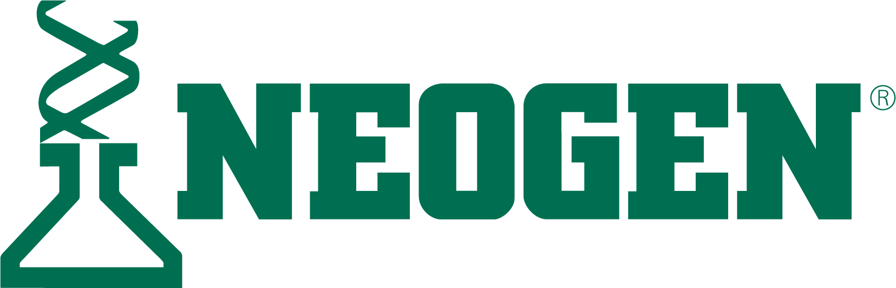

# Neogen Job Advert Generator

A Streamlit app that converts job description documents (`.docx` or `.pdf`) into polished job adverts in the **Neogen House Style**.



---

## 🚀 Features
- Upload `.docx` or `.pdf` job description files
- Extracts text automatically
- Uses OpenAI GPT model to rewrite into Neogen advert style
- Preview output in the app
- Download final advert as `.docx`

---

## 🛠 Local Installation

```bash
git clone https://github.com/your-org/neogen-job-advert-generator.git
cd neogen-job-advert-generator
pip install -r requirements.txt
export OPENAI_API_KEY=your_api_key_here   # PowerShell: setx OPENAI_API_KEY "your_api_key_here"
streamlit run app.py
```

Open http://localhost:8501 in your browser.

---

## 🐳 Docker

```bash
docker build -t neogen-job-advert-generator .
docker run -p 8501:8501 -e OPENAI_API_KEY=your_api_key_here neogen-job-advert-generator
```

---

## 📌 Notes
- PDF text extraction uses `PyPDF2`. Scanned PDFs or heavy layout may reduce extraction quality; consider exporting a text-based PDF or DOCX where possible.
- The app reads your OpenAI API key from the `OPENAI_API_KEY` environment variable.
- Output includes the standard closing line: _"Please press Apply to submit your application."_

---

## 📂 Project Structure

```
neogen-job-advert-generator/
├── app.py
├── assets/
│   └── neogen-logo-green.webp
├── requirements.txt
├── Dockerfile
├── .gitignore
└── README.md
```